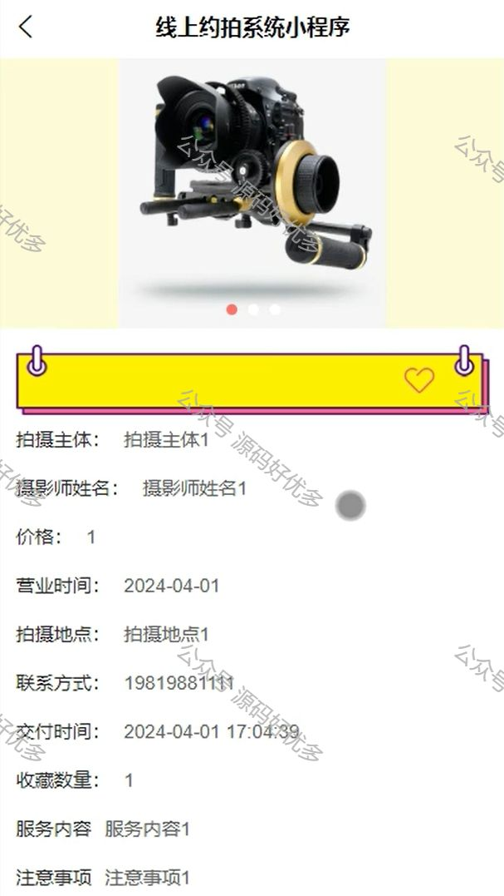

# mpweixinA054
mpweixinA054线上约拍微信小程序
 
## 查看主页获取源码

> **作者介绍**： **✌**全网粉丝10W+本平台特邀作者、博客专家、CSDN新星计划导师、java领域优质创作者,博客之星、掘金/华为云/阿里云/InfoQ等平台优质作者、专注于项目实战 **✌**

  

### 一、作品包含

源码+数据库+全套环境和工具资源+部署教程

### 二、项目技术

前端技术：Html、Css、Js、Vue、Element-ui

数据库：MySQL

后端技术：Java、Spring Boot、MyBatis

  

### 三、运行环境

开发工具：IDEA/eclipse + 微信开发者工具

数据库：MySQL5.7

数据库管理工具：Navicat10以上版本

环境配置软件： JDK1.8+Maven3.6.3

前端Nodejs：14

### 四、项目介绍
项目编号：mpweixinA054

线上约拍小程序包括原生微信小程序和uniapp版本，为用户提供了一个便捷的平台，可以快速预约摄影师进行专业拍摄服务。

管理员功能模块
用户管理：管理员可以添加、删除和更新用户信息，确保用户数据的准确性和安全性。
动态信息管理：管理员可以发布和管理平台上的动态信息，保持用户的关注和互动。
公告信息管理：管理员可以发布和编辑公告信息，及时通知用户重要事项。
反馈信息管理：管理员可以查看和处理用户提交的反馈信息，提升平台服务质量。
约拍信息管理：管理员可以管理所有用户的约拍信息，安排和协调摄影师的工作。
订单信息管理：管理员可以查看和管理所有用户的订单信息，确保订单处理的及时和准确。
轮播图管理：管理员可以添加、删除和更新首页轮播图，提升平台的视觉效果和用户体验。

用户功能模块
查看公告信息：用户可以浏览平台发布的公告信息，获取最新动态和通知。
查看动态信息：用户可以查看平台发布的动态信息，了解最新的约拍活动和摄影作品。
提交反馈信息：用户可以在线提交反馈和建议，帮助平台提升服务质量。
预约拍摄：用户可以在线选择摄影师和时间，预约拍摄服务。
提交订单：用户可以确认拍摄订单并完成支付，享受便捷的线上服务。

### 五、运行截图

  
